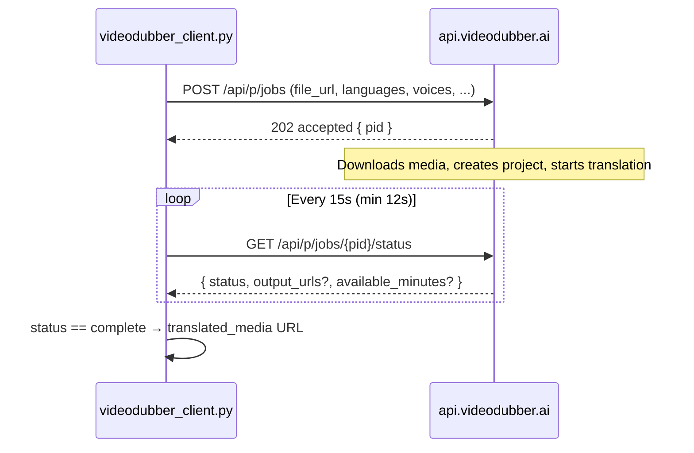

# VideoDubber API Client

Documentation for the **VideoDubber video translation API** at [https://videodubber.ai/](https://videodubber.ai/) — translate video or audio by submitting a public media URL and polling for the translated output.

**Reference implementation:** [scripts/videodubber_client.py](./scripts/videodubber_client.py) (Python CLI and library).

---

## Requirements

- Python 3.10+
- The `requests` package
- A VideoDubber **API key**
- A **public HTTP(S) URL** to the source media file

---

## Authentication

Every API request must include your API key in the `x-api-key` header.

### Getting an API key

Create a key from the VideoDubber app (API settings), or while logged in via the session endpoints:

| Method | Endpoint | Description |
|--------|----------|-------------|
| `GET` | `/api/p/api-key` | Return existing key |
| `POST` | `/api/p/api-key` | Generate a new key |
| `DELETE` | `/api/p/api-key` | Delete existing key |

### Setting the key for the CLI

Either pass it on the command line:

```bash
--api-key "your-api-key"
```

Or set an environment variable:

```bash
export VIDEODUBBER_API_KEY="your-api-key"
```

---

## How the workflow works



### Step 1 — Create job

**Endpoint:** `POST /api/p/jobs`

The server:

1. Validates your request (language, voices, available minutes)
2. Downloads the file from `file_url`
3. Creates a project and writes config files
4. Starts the translation job (`job0`)

**Success response (HTTP 202):**

```json
{
  "status": "accepted",
  "pid": "abc123...",
  "project_path": "/path/on/server"
}
```

Save `pid` — you need it to poll status.

### Step 2 — Poll status

**Endpoint:** `GET /api/p/jobs/<pid>/status`

Poll until `status` is `complete` or `failed`.

**Typical processing statuses:**

| Status | Meaning |
|--------|---------|
| `processing` | Job is running |
| `Need` | Queued, waiting for a worker |
| `Taken_up` | Worker picked up the job |
| `complete` | Finished — output URLs available |
| `failed` | Job failed — see response body for details |

When complete, the response includes `output_urls.translated_media` — a URL to download the translated file.

---

## Rate limits

Rate limits apply **per API key** (`x-api-key`), not per IP.

### Server limit

| Endpoint | Limit |
|----------|-------|
| `POST /api/p/jobs` | **5 requests / minute** |
| `GET /api/p/jobs/<pid>/status` | **5 requests / minute** |

Both endpoints share the same limit bucket for your API key. If you exceed the limit, the server returns **HTTP 429 Too Many Requests**.

### What the Python client does

The script protects you in two ways:

#### 1. Proactive throttling

Before each `/api/p/*` request, the client waits until at least **12 seconds** have passed since the last API call. This keeps you under the server’s 5/minute cap (5 × 12 s = 60 s).

You cannot poll faster than 12 seconds, even if you pass a lower `--poll-interval`.

#### 2. Automatic retry on 429

If the server still returns 429, the client:

1. Reads `Retry-After` from the response header (or from the JSON body)
2. Sleeps for that duration (or uses exponential backoff: 2 s, 4 s, 8 s, … up to 120 s)
3. Retries up to **8 times** by default

If all retries fail, the script exits with a `rate limit:` error on stderr.

### Polling interval

| Setting | Default | Minimum enforced |
|---------|---------|------------------|
| `--poll-interval` | **15 seconds** | **12 seconds** |

**Recommendation:** leave the default at 15 s. One translation job typically uses:

- **1 request** to create the job
- **N requests** to poll status (one every 15 s until done)

Example: a 5-minute job needs roughly 1 + (300 / 15) ≈ **21 API calls** over ~5 minutes — well within the 5/minute limit because calls are spaced out.

### Rate limit planning

| Scenario | Safe? | Notes |
|----------|-------|-------|
| One job, default polling | Yes | Designed for this |
| Multiple jobs in parallel with one API key | Risky | Shared 5/min limit across all jobs |
| Polling every 5 s | No | Client clamps to 12 s minimum |
| Burst of 6+ job creates in one minute | No | Will hit 429 |

For multiple concurrent jobs, use separate API keys or serialize job creation with ≥12 s between submits.

---

## File limits

### Source file requirements (paid accounts)

| Constraint | Limit |
|------------|-------|
| Max file size | 20 GiB |
| URL scheme | `http` or `https` only |
| YouTube page URLs | **Not supported** |

The URL must point directly to the media file (e.g. a signed S3/GCS link or direct `.mp4` link). YouTube watch links are rejected.

---

## CLI usage

### Basic example

```bash
export VIDEODUBBER_API_KEY="your-uuid-key"

python scripts/videodubber_client.py \
    --file-url "https://example.com/video.mp4" \
    --original-language English \
    --target-language Spanish \
    --voice Elvira \
    --output ./translated.mp4
```

### Multiple speakers

```bash
python scripts/videodubber_client.py \
    --file-url "https://example.com/interview.mp4" \
    --target-language French \
    --num-speakers 2 \
    --voice Denise \
    --voice Henri \
    --speaker "Speaker 1" \
    --speaker "Speaker 2"
```

### JSON output (for automation)

```bash
python scripts/videodubber_client.py \
    --file-url "https://example.com/video.mp4" \
    --target-language German \
    --voice Katja \
    --json \
    --quiet
```

Prints the final status object to stdout. Progress logs go to stderr unless `--quiet` is set.

---

## CLI reference

### Required arguments

| Argument | Description |
|----------|-------------|
| `--file-url` | Public HTTP(S) URL to the source video or audio |
| `--target-language` | Target language display name, e.g. `Spanish`, `French` |
| `--voice` | Voice display name for the target language (repeat per speaker) |

### Authentication and environment

| Argument / variable | Description |
|---------------------|-------------|
| `--api-key` | API key |
| `VIDEODUBBER_API_KEY` | Same as `--api-key` (env fallback) |
| `--base-url` | API origin (default: `https://api.videodubber.ai`) |
| `VIDEODUBBER_API_BASE` | Same as `--base-url` (env fallback) |

### Job options

| Argument | Default | Description |
|----------|---------|-------------|
| `--original-language` | `unknown` | Source language name, or `unknown` for auto-detect |
| `--num-speakers` | `1` | `1`, `1 (female)`, `Auto Detect`, or `2`, `3`, … |
| `--project-name` | `API Project` | Project label shown in the app |
| `--speaker` | `Speaker 1`, … | Speaker label per `--voice` (must match count) |
| `--voice-cloning` | off | Enable instant voice cloning |
| `--filetype` | inferred from URL | Extension without dot: `mp4`, `mp3`, `mov`, … |
| `--audioshift` | `0` | Audio sync offset in milliseconds (string) |
| `--translator` | `auto` | Translation backend hint |
| `--glossary-id` | empty | Optional DeepL glossary UUID |
| `--bg1` | `Auto (Not recommended)` | Background sound handling |

### Polling and output

| Argument | Default | Description |
|----------|---------|-------------|
| `--poll-interval` | `15` | Seconds between status polls (minimum 12) |
| `--max-wait` | `3600` | Max seconds to wait for completion |
| `--output` | none | Download translated media to this local path |
| `--json` | off | Print final status JSON to stdout |
| `--quiet` | off | Suppress progress on stderr |
| `--debug` | off | Print raw status JSON on every poll |

### Exit codes

| Code | Meaning |
|------|---------|
| `0` | Job completed successfully |
| `1` | Error (API error, rate limit, timeout, job failed, etc.) |

---

## Target languages

Pass **display names** exactly as shown in the Video Translation UI at [app.videodubber.ai](https://app.videodubber.ai/).

```bash
--target-language "Spanish (Spain)"
--target-language "French (France)"
--target-language "English (US)"
```

If you pass an invalid name, the API returns **HTTP 400** with a list of accepted target languages:

```
error: Invalid TargetLanguage
received: Spanish
accepted target languages (161):

  - Afrikaans (South Africa)
  - Albanian (Albania)
  ...
```

---

## Voices

Pass **display names** exactly as shown in the Video Translation UI at [app.videodubber.ai](https://app.videodubber.ai/).

```bash
--voice Elvira      # correct for Spanish
--voice Jenny       # example for English (US)
```

Voice names must exist for the chosen `--target-language`. If you pass an invalid name, the API returns **HTTP 400** with a list of accepted voices:

```
error: Invalid voice
accepted voices for Spanish (12):

male voices:
  - Alvaro
  ...
female voices:
  - Elvira
  ...
```

Use `--debug` while polling if you need the full raw status payload.

---

## Using as a Python library

Import the client and dataclasses from the script:

```python
from videodubber_client import (
    VideoDubberClient,
    TranslationJobParams,
)

client = VideoDubberClient(api_key="your-uuid-key")

params = TranslationJobParams(
    file_url="https://example.com/video.mp4",
    target_language="Spanish",
    original_language="English",
    selectedvoices=["Elvira"],
    speakers=["Speaker 1"],
    filetype="mp4",
)

# Submit + poll until complete
status = client.translate_from_url(params, poll_interval=15, max_wait=3600)

print(status.translated_media_url)
```

### Library methods

| Method | Description |
|--------|-------------|
| `create_job_from_url(params)` | Submit job only; returns `{ pid, status, ... }` |
| `get_job_status(pid)` | Single status check; returns `JobStatus` |
| `wait_for_job(pid, ...)` | Poll until complete, failed, or timeout |
| `translate_from_url(params, ...)` | Create + wait (full workflow) |
| `health()` | `GET /` health check (no rate-limit throttle) |

---

## Common errors

| HTTP | Error | Cause |
|------|-------|-------|
| 400 | `Missing required fields` | Incomplete JSON body |
| 400 | `Invalid TargetLanguage` | Unknown target language name |
| 400 | `Invalid voice` | Voice display name not valid for target language |
| 400 | `YouTube URLs are not supported` | URL is not a direct media file |
| 403 | `insufficient_credits` | Not enough available minutes (see `available_minutes` in the response) |
| 404 | `project_not_found` | Invalid or expired `pid` |
| 429 | Rate limited | More than 5 API calls per minute |
| 502 | `Failed to download file_url` | Server could not fetch your media URL |

The CLI prints structured hints for validation errors (accepted languages, accepted voices). Other errors print as `error: ...` on stderr.

---

## Tips

- Host media on a **stable, publicly reachable URL** before calling the API. The server downloads the file; private or expiring links may fail.
- Use **`--output`** to save the translated file locally after the job completes.
- For long jobs, increase **`--max-wait`** (default is 1 hour).
- Run with **`--debug`** when integrating to inspect status payloads on each poll.
- Do not run many parallel jobs on a **single API key** — they share the 5/minute rate limit.
